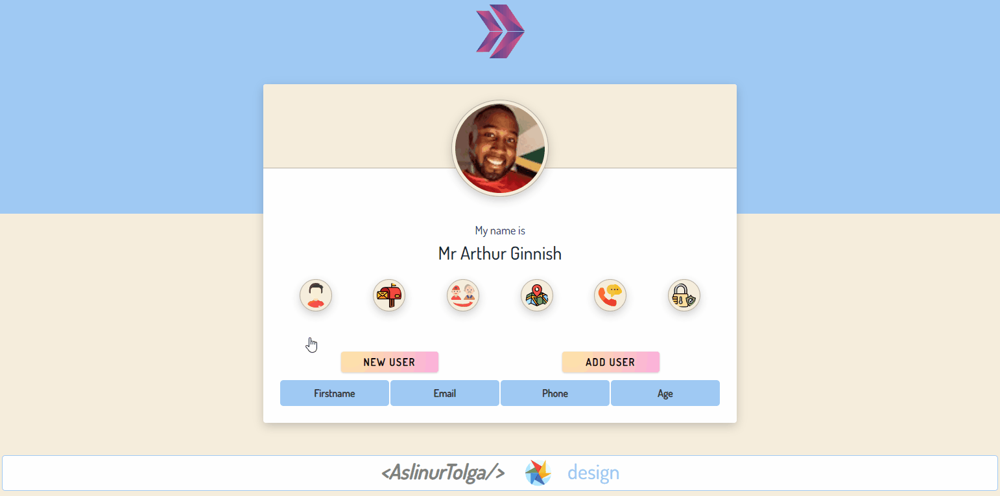

# 🚀 Random User App II React Project

## Animation of the Website



## Visulation of the Website


## Project Skeleton

```
004 - Random User App II (folder)
|
|----readme.md         
SOLUTION
├── public
│     └── index.html
├── src
│    ├── assets.js
│    │       └── [images]
│    ├── App.js
│    ├── App.css
│    ├── index.js
│    └── index.css
├── package.json
└── yarn.lock
```

##Objective
Build a Random User App using ReactJS.

At the end of the project, following topics are to be covered;
HTML

CSS

JS

ReactJS

##At the end of the project, students will be able to;
Improve coding skills within HTML & CSS & JS & ReactJS.

Use git commands (push, pull, commit, add etc.) and Github as Version Control System.

##Steps to Solution
Step 1: Create React App using npx create-react-app random-user-app-two.

Step 2: Build Random User App fetching data from https://randomuser.me/api/ using axios.

Step 3: Push your application into your own public repo on Github.

Step 4: Add project gif to your project and README.md file.